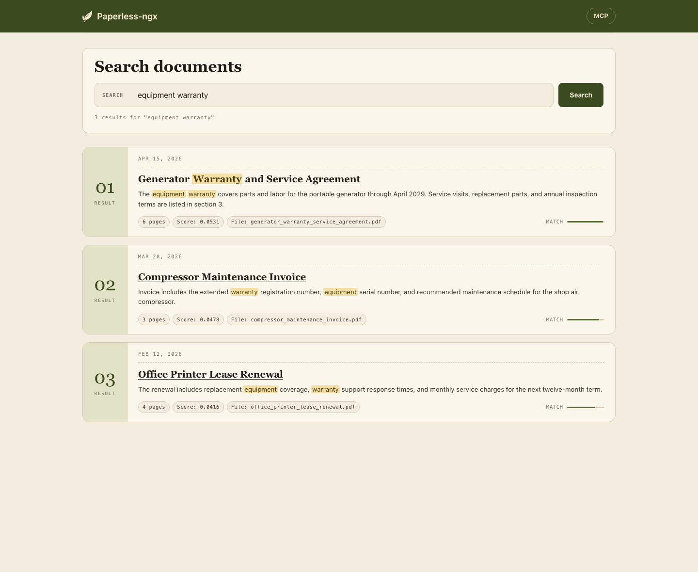
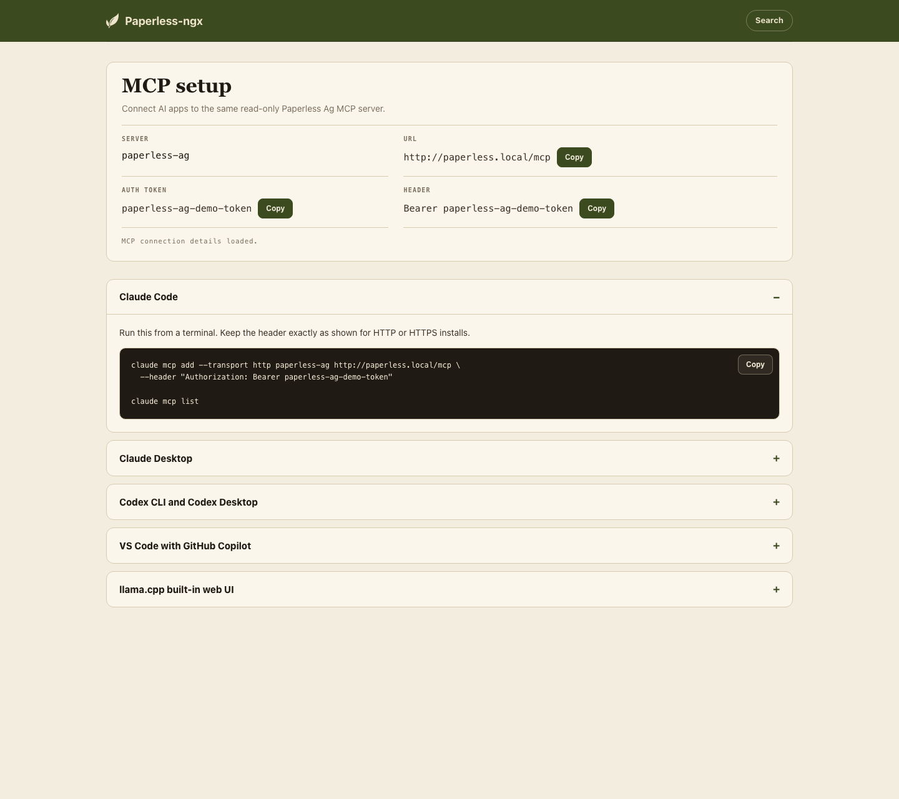

# Paperless AI

A companion container for [Paperless-ngx](https://github.com/paperless-ngx/paperless-ngx) that adds semantic search, a same-origin search page, and optional MCP access for AI apps. Built for the [Fullstack Ag](https://fullstack.ag) community.

## The Problem

Farmers and ranchers accumulate a lot of documents -- leases, seed contracts, crop insurance policies, FSA paperwork, chemical application records, equipment manuals, tax returns, succession plans, soil test results. Most of this ends up in filing cabinets, scattered Google Drive folders, or boxes in the shop.

The problem is retrieval. Paperless-ngx handles ingestion, OCR, and keyword search well, but keyword search only works when you remember the exact words in the document. Search "fertilizer recommendations" when the document says "nutrient management plan" and you get zero results.

## What This Adds

A single Docker container that sits alongside a stock Paperless-ngx installation and provides:

1. **Semantic search via pgvector** -- extends the Postgres database Paperless already requires. No additional vector database needed.
2. **A browser search app at `/search`** -- reuses your Paperless login and opens results in the normal Paperless document viewer.
3. **An MCP server for AI apps** -- optional read-only access for tools like Claude, Codex, VS Code/Copilot, and llama.cpp.

Paperless-ngx stays completely stock.

## Deploy

SSH into any Linux server and run:

```bash
curl -fsSL https://paperless.fullstack.ag/install.sh | bash
```

To test a branch or fork image before it becomes `latest`, publish that image
tag and pass it to the installer:

```bash
gh workflow run publish-image.yml \
  --repo NerdOutInc/paperless-ag \
  --ref your-branch-name
```

```bash
curl -fsSL https://raw.githubusercontent.com/NerdOutInc/paperless-ag/your-branch-name/docs/install.sh \
  | COMPANION_IMAGE=ghcr.io/nerdoutinc/paperless-ag:your-branch-name bash
```

The installer detects if you already have Paperless-ngx running and walks you through setup. Works on any VPS -- pick one to get started:

[](https://cloud.digitalocean.com/droplets/new?size=s-2vcpu-4gb&image=docker-20-04&region=nyc1)
[](https://console.hetzner.cloud/)
[](https://www.vultr.com/products/cloud-compute/)

> **Minimum practical specs:** 2 vCPU, 4 GB RAM. **Recommended:** 8 GB RAM for more headroom during embedding and Paperless OCR. New DigitalOcean accounts get $200 in free credits.

## Search in the Browser

After installation, open your Paperless URL and add `/search`.

```text
https://yourdomain.com/search
```

Log in with your Paperless account if prompted. Search results link back to the
stock Paperless document page at `/documents/{id}`.



## MCP Support

MCP access is optional. It lets AI apps use Paperless AI's read-only search
tools without exposing Postgres or modifying Paperless-ngx.

After installation, log in to Paperless and open:

```text
https://yourdomain.com/search/mcp
```

That page shows your MCP server URL, the auth token for Paperless admins, and
current setup instructions for Claude Code, Claude Desktop, Codex, VS
Code/Copilot, and llama.cpp.



## Architecture

```plaintext
Paperless-ngx (stock)  <-->  Companion Container       <-->  PostgreSQL + pgvector
     Web UI (:8000)          Search Web UI (/search)          document_embeddings table
     REST API                MCP Server (/mcp)
     Consumer                Embedding Worker
```

The companion container:

- Polls Paperless for new documents and generates vector embeddings using a local model (all-MiniLM-L6-v2)
- Stores chunk-level embeddings in pgvector alongside Paperless's existing tables
- Exposes a same-origin read-only search UI at `/search`
- Exposes hybrid search (semantic + keyword) through a read-only MCP server

## Local Development

### Prerequisites

- Docker and Docker Compose
- Python 3.11+
- Google Chrome (for test data PDF generation)

### Start Paperless-ngx and companion app

```bash
docker compose up -d
```

Paperless will be available at <http://localhost:8000> (admin / admin).
For local development, log in to Paperless first at <http://localhost:8000>.
You can smoke-test the companion UI and API at
<http://localhost:3001/search>, but document links only work when Paperless and
the companion share an origin. Installed deployments provide that through Caddy
at `/search`.

### Load Test Data

The `test-data/` directory contains a generator that creates 100 fake farm/ranch PDFs and uploads them to Paperless with metadata for testing in development:

```bash
cd test-data
pip3 install -r requirements.txt
python3 generate.py    # Generate 100 PDFs
python3 upload.py      # Upload to Paperless with metadata
```

See [test-data/README.md](test-data/README.md) for details on the test documents, farms, and document types.

### Smoke-test the local MCP server

For local development, give the companion a temporary MCP token without editing
tracked Compose files:

```bash
cat >/tmp/paperless-ag.override.yml <<'YAML'
services:
  app:
    environment:
      MCP_AUTH_TOKEN: paperless-ag-local-demo
YAML

docker compose -f docker-compose.yml -f /tmp/paperless-ag.override.yml up -d --build
```

Verify the MCP server and embeddings:

```bash
curl -f http://localhost:3001/health

docker compose exec -T db psql -U paperless -d paperless \
  -c "select count(*) as embedding_rows, count(distinct document_id) as embedded_documents from document_embeddings;"
```

Then use `http://localhost:3001/mcp` with the bearer token
`paperless-ag-local-demo` in an MCP client. The local demo should report 100
embedded documents after the test data finishes processing.

## Uninstall

To completely remove Paperless AI and all its data from your server (`/root/paperless-ag` is the default install directory -- adjust if you chose a different path during setup):

```bash
cd /root/paperless-ag
docker compose down -v
crontab -l | grep -v paperless-ag | crontab -
cd ~
rm -rf /root/paperless-ag
```

> **Warning:** This deletes all documents and database contents. Run `bash /root/paperless-ag/backup.sh` first if you want to keep your data.

## Project Status

This project is in early development. Current progress:

- [x] Local Paperless-ngx dev stack (Docker Compose with pgvector-enabled Postgres)
- [x] Test data generator (100 realistic farm documents across 3 fictional farms)
- [x] Companion container with embedding worker
- [x] pgvector search API (semantic + hybrid)
- [x] Same-origin browser search UI
- [x] MCP server for AI app integration
- [x] Install script for VPS deployment
- [ ] DigitalOcean 1-click Marketplace image
